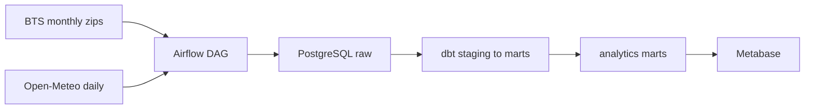
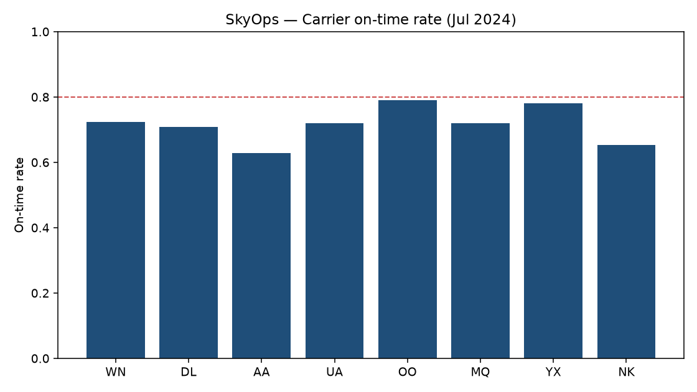
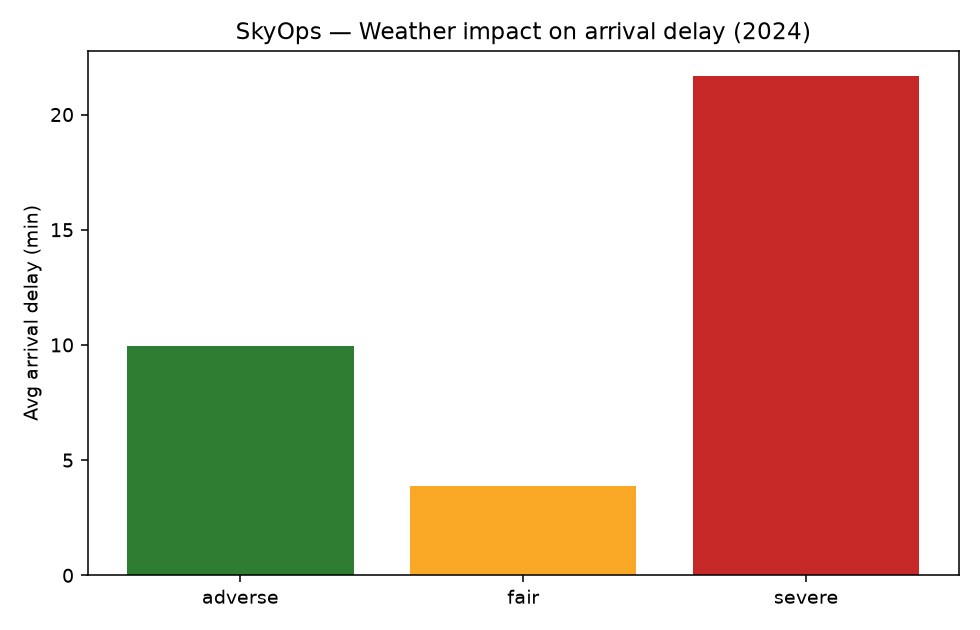

# SkyOps

[](https://github.com/sauravpatel0512/SkyOps/actions/workflows/ci.yml)
[](LICENSE)
[](https://python.org)
[](https://www.getdbt.com/)

USA airline operations analytics: **Airflow** loads [BTS On-Time](https://www.transtats.bts.gov/ontime/) flights + **Open-Meteo** hub weather into **PostgreSQL**, **dbt** builds reliability/weather marts, **Metabase** serves them.

## Architecture



| Layer | What it proves |
|-------|----------------|
| **Ingest** | Monthly BTS PREZIP + hub weather API, idempotent loads |
| **Model** | Staging → enriched flights → dims/facts → marts |
| **Quality** | dbt tests on keys + relationships |
| **Serve** | Metabase on `analytics.mart_*` |

## Debugging notes (real failures)

1. **BTS PREZIP 403** — naive HTTP clients get blocked; use a browser-like `User-Agent` / `Referer`, or place zips manually under `data/raw/bts/`.
2. **protobuf × dbt on CI** — pin `protobuf>=4.25.3,<5` with `dbt-core==1.7.14`.
3. **Host port 5432 clash** — SkyOps publishes Postgres on **5433**; containers still talk to `postgres:5432`.

Longer write-up: **[docs/FAILURE_NOTES.md](docs/FAILURE_NOTES.md)**.

## Quick start

1. `cp .env.example .env` and start Docker Desktop.
2. Download demo year (default 2024):

   ```bash
   pip install -r requirements.txt
   make download
   ```

3. `docker compose up -d --build` then `make init-db` (if DB already existed without init scripts).
4. Trigger `skyops_daily` in Airflow (`http://localhost:8080`, creds from `.env.example`).
5. Metabase (`http://localhost:3000`) → Postgres `skyops` → schema `analytics`.

Full transcript: **[docs/RUNBOOK.md](docs/RUNBOOK.md)**. Evidence: **[docs/validation-log.md](docs/validation-log.md)**.

```bash
make help
make lint && make test
```

**CI** runs ruff + fixture load + `dbt build` + pytest (no full-year download on runners).

## Outputs





- `mart_carrier_reliability` — on-time % / cancel rate by carrier × month
- `mart_airport_ops` — origin airport delay/cancel
- `mart_weather_impact` — delay vs fair/adverse/severe origin weather
- `mart_route_performance` — OD pair volume + delay

Verified local run: **7,079,061** flights (BTS 2024) + hub weather; dbt `PASS=42`.

## Layout

| Path | Role |
|------|------|
| `ingestion/` | BTS download, weather fetch, loaders |
| `airflow/` | `skyops_daily` DAG |
| `dbt/` | Models, tests, seeds |
| `sql/` | Schemas + raw DDL |
| `data/raw/` | Cached BTS/weather (gitignored) |
| `data/fixtures/` | Tiny CI sample |
| `docs/` | Runbook, failure notes, validation log |

## License

MIT — see `LICENSE`.
